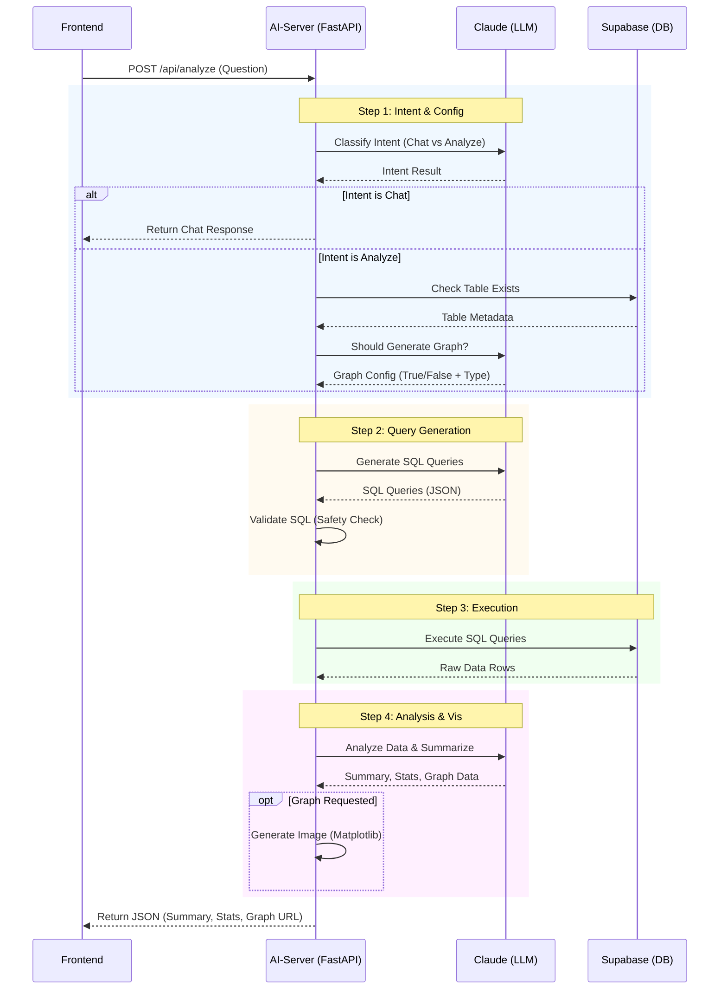
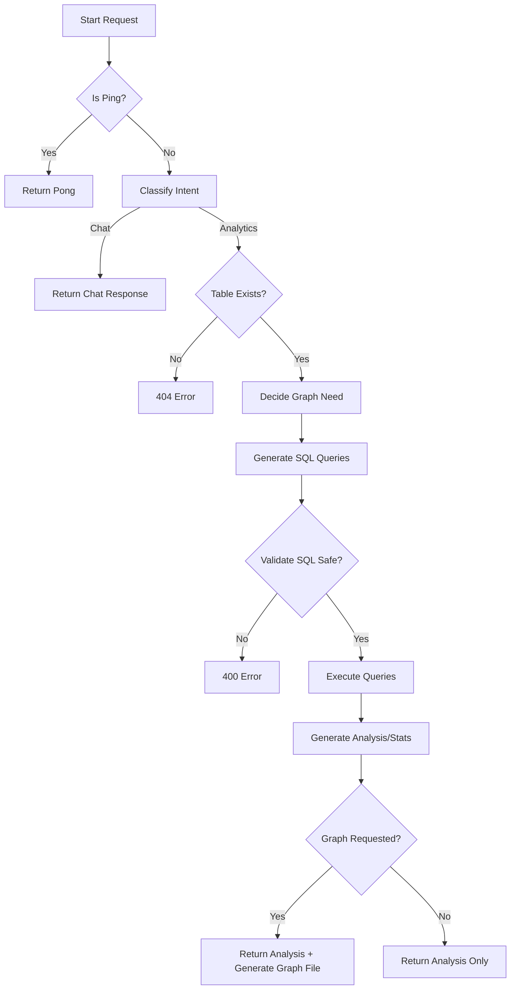

# AI-Enhanced Data Module

This project is a small web app

1. Lets users upload a CSV or JSON file
2. Displays data in an interactive table
3. Provides filtering capabilities
4. Provides data editing capabilities (add new row, edit existing cells)
5. Integrates a simple AI assistant panel that can summarize the data

## Features

- **CSV Upload**: specialized route to upload CSV files which are parsed and seeded into the database.
- **Data Grid**: robust table with sorting, filtering, and pagination.
- **Dynamic Tables**: database support for multiple uploaded tables with a fixed schema.
- **Editing**: inline editing of table rows with batch updates.
- **Filtering**: custom filters including date ranges and deal stages.
- **AI Assistant**: intelligent data analysis using LLMs.

## Setup Instructions

This project is a monorepo with a frontend and an AI server.
Frontend is a Vite+React app and AI server is a FastAPI app, located in `ai-server` directory.
The frontend is responsible for user interface and file upload.
The AI server is responsible for LLM communication, interfacing tool calling, and graph generation.

### Prerequisites

- [Node.js](https://nodejs.org/) (v16+)
- [Supabase Account](https://supabase.com/)
- [Python](https://www.python.org/) (v3.8+)
- [Anthropic API Key](https://console.anthropic.com/)
- [Docker](https://www.docker.com/) (optional)

### Installation

1. Clone the repository: ```bash
    git clone <repository_url>
    cd <repository_directory>```

### Environment Configuration

1. Create a `.env` file in the root of the project (copy from `.env.sample` and rename).
2. Add your Supabase credentials:

    ```env
    VITE_SUPABASE_URL=your supabase Project URL
    VITE_SUPABASE_ANON_KEY=your supabase Publishable API Key
    VITE_AI_SERVER_URL = http://localhost:8000 # AI server URL, keep it as is
    ```

3. `cd ai-server` and create a `.env` file in the `ai-server` directory with the following variables:

    ```env
    ANTHROPIC_API_KEY=your anthropic API Key
    SUPABASE_URL=your supabase Project URL
    SUPABASE_KEY=your supabase Publishable API Key
    ```

### Database Setup

1. Go to your Supabase project dashboard.
2. Navigate to the **SQL Editor**.
3. Copy & paste the contents of [supabase_setup.sql](./supabase_setup.sql) in SQL editor and run it.
    - This script creates the `master_uploads` table.
    - It defines the `create_leads_table` RPC function used to dynamically create tables for each CSV upload.
4. Copy & paste the contents of [ai-server\readonly_json.sql](./ai-server/readonly_json.sql) in SQL editor and run it.
    - This script creates the `readonly_json` table.
5. With the sample data having more than 1000 rows, you will need to increase the API limit in the Supabase dashboard to at least 10000 rows.

## Production Deployment

1. To deploy the production environment with Docker compose:

```bash
docker compose up --build
```

## Development Deployment

1. To deploy the development environment locally:

```bash
# navigate to the root directory
cd .
npm run dev
```

```bash
# navigate to the ai-server directory
cd ai-server

# active the virtual environment
venv\Scripts\activate

# install dependencies
pip install -r requirements.txt

# run the server
fastapi dev main.py
```

Open [http://localhost:5173](http://localhost:5173) in your browser for frontend in development, [http://localhost:80](http://localhost:80) for production.
[http://localhost:8000](http://localhost:8000) for ai-server, you can use postman to test the API.

## Database Structure

The application uses a dynamic table structure managed by Supabase.

### 1. `master_uploads`

Stores metadata for every CSV file uploaded.

| Column | Type | Description |
| :--- | :--- | :--- |
| `id` | uuid | Primary Key |
| `filename` | text | Name of the uploaded file |
| `created_at` | timestamp | Upload timestamp |
| `table_name` | text | Name of the dynamic table (e.g., `leads_123`) |

### 2. `leads_{id}` (Dynamic Tables)

Each uploaded CSV is stored in its own table with a **FIXED** schema.

| Column | Type | Description |
| :--- | :--- | :--- |
| `id` | uuid | Primary Key |
| `date` | date | Lead date |
| `lead_owner` | text | Owner of the lead |
| `source` | text | Lead source (e.g., Website, Referral) |
| `deal_stage` | text | Current stage (e.g., Interest, Closed Won) |
| `account_id` | text | Associated account ID |
| `first_name` | text | Lead first name |
| `last_name` | text | Lead last name |
| `company` | text | Company name |

## API Reference

The application uses a service layer located in `src/services/api.js` to interact with Supabase.

### Core Functions

- **`fetchMasterUploads()`**
  - Fetches all uploaded file records from `master_uploads`.

- **`fetchTableData(id)`**
  - Fetches all rows from a dynamic table specified by `id`.
  - *Note*: If `id` is "1", returns mock data.

- **`createMasterEntry(filename, tableName)`**
  - Inserts a new record into `master_uploads`.

- **`createTableSchema(tableName)`**
  - Calls the `create_leads_table` RPC function to create a new DB table.

- **`insertTableData(tableName, data)`**
  - Bulk inserts parsed CSV data into the specified dynamic table.

- **`updateTableRow(tableName, rowId, updates)`**
  - Updates a single row in the specified table.

- **`batchUpdateTableRows(tableName, updates)`**
  - Updates multiple rows efficiently using `upsert`.

- **`addTableRow(tableName, rowData)`**
  - Inserts a single new row into the specified table.

- **`deleteTableRows(tableName, rowIds)`**
  - Deletes multiple rows identified by `rowIds`.

## Design Trade-offs

### 1. Database Dynamic Table Generation vs Monolithic Data Table

- **Decision**: Dynamic table generation (creating a new `leads_{id}` table for each upload).
- **Trade-off**: This approach ensures strict data isolation and simplifies queries for individual datasets. It avoids the complexity of managing a massive, monolithic table with a `file_id` partition key. However, it can lead to schema bloating in the database if thousands of files are uploaded. For the current scope, the isolation and simplicity benefits outweigh the schema management overhead.

### 2. Client-Side Pagination vs Server-Side Pagination

- **Decision**: Client-side pagination.
- **Trade-off**: Given the projected data scale (approx. 10,000 rows), client-side pagination offers a superior user experience with instant sorting, filtering, and page transitions without network latency. Server-side pagination is more scalable for millions of records but introduces complexity in state management and API design. Client-side handling was chosen for easier implementation and snappier UI performance within the expected constraints.

### 3. AI-Server as Middle Layer

- **Decision**: Using a dedicated FastAPI Python server (`ai-server`) between the Frontend and LLM/Database.
- **Trade-off**:
  - **Pros**:
    - **Decoupling**: Validates inputs and sanitizes data before reaching the LLM or DB.
    - **Security**: Keeps API keys and database service roles on the server, never exposing them to the client.
    - **Capability**: Enables Python-exclusive libraries (like `matplotlib` for graph generation and complex data processing) that are difficult or impossible to run in the browser.
  - **Cons**: Increases development time and deployment complexity (requires managing a separate container/service) compared to a simple Serverless function or direct client calls.

### System Interaction Diagram

The following sequence diagram demonstrates the communication between Frontend, AI-Server, LLM, and Database:



### AI Analytics Flow

The following flowchart illustrates the logic within `ai-server/main.py` for handling analytics conversations:


